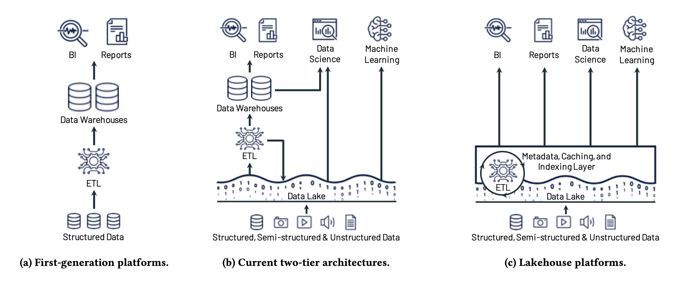

# Databricks

A cloud-based data lakehouse for data analytics and AI.

---

## Data Lakehouse Introduction

In the two-tier architecture:

1. For BI work, data is sent to data warehouse from data lake.
2. For ML work, data is directly queried from data lake,

### Problems with two-tier architecture

1. Keeping the data lake and warehouse consistent is difficult.
2. Data in the warehouse is staled compared to that of the data lake.
   - Transfering data from data lake to warehouse takes significant time.
3. There's limited support for machine learning.
   - Query code is too complex for data warehouse to handle.
   - No management support, such as ACID and versioning, in data lake.

### Lakehouse Solutions

1. Provides data management, such as transactions and versioning on data lakes.
2. Support for machine learning through offering declarative DataFrame API
   - Declarative DataFrame API allows the user to describe the desired result of the data trasformation instead of the step instructions.
   - The user program (DataFrame operations) provide a query plan for Delta Lake client library, where execution is optimized.
3. SQL Performance optimizations:
   - Caching.
   - Auxiliary data such as min-max statistics
   - Record ordering: cluster certain records together for easier read.