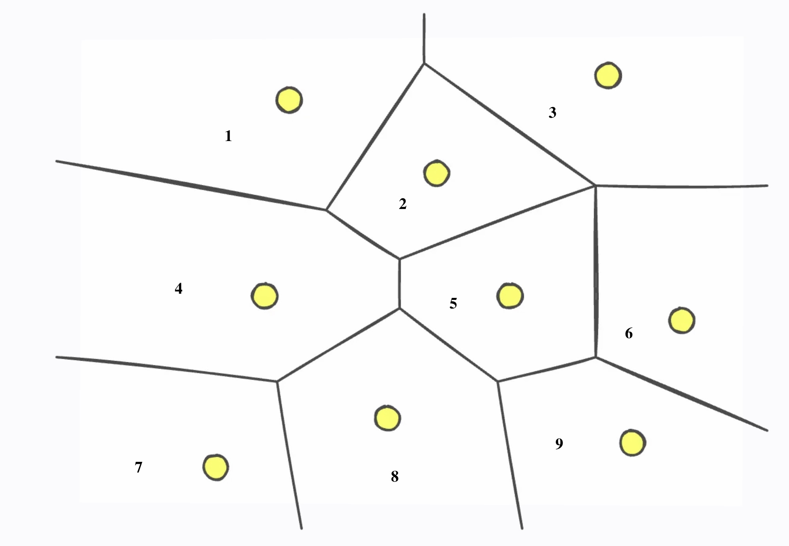
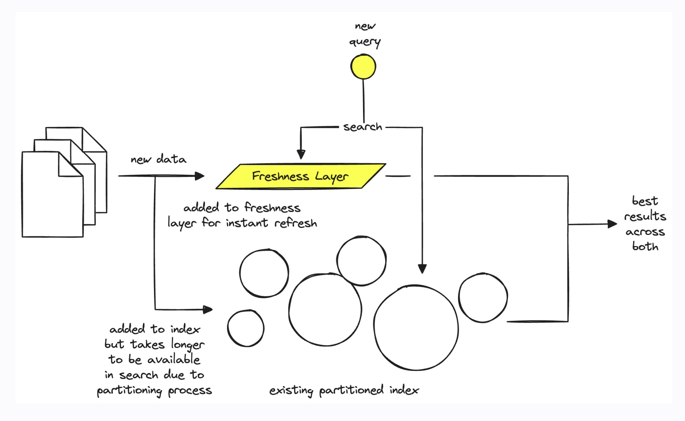
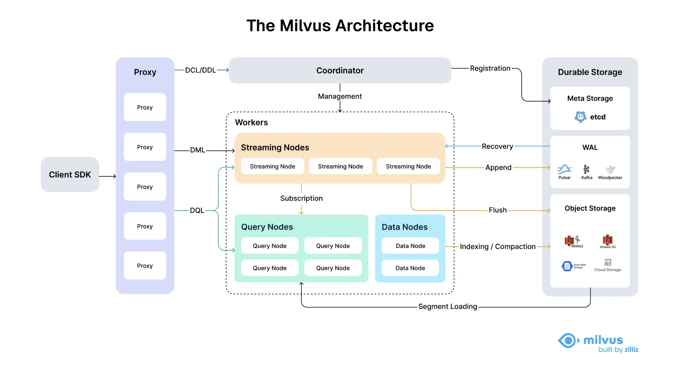

# Milvus

*Milvus* is an open-source vector database built for GenAI applications.

---

## Vector Database

To understand Milvus, we need to learn what Vector Database is.

A **Vector Database** stores and indexes vector embeddings.

### Why We Need Vector Databases

Why do we need Vector DB when we have FAISS?

1. **CRUD Operations** FAISS indexes are largely static. Deleting or updating a single vector is unsupported. Vector DBs support real-time inserts, updates, and deletes gracefully.
2. **Scalability** FAISS runs on a single machine. Vector databases are built for horizontal scaling.
3. **Persistence** FAISS stores indexes in memory. If your process crashes, your index is gone. Vector DBs handle durability automatically.

### How It Works

1. **Indexing**: The vector database indexes vectors using an algorithm such as PQ, LSH, or HNSW (more on these below). This step maps the vectors to a data structure that will enable faster searching.
2. **Querying**: The vector database compares the **indexed query vector** to the **indexed vectors in the dataset** to **find the nearest neighbors**
3. **Post Processing**: In some cases, the vector database retrieves the final nearest neighbors from the dataset and applies a more careful analysis to re-rank them before returning the final result to you.

Note: traditional index is for deterministic search (100% accurate). VectorDB index is for probabilistic search (<= 100% accurate).

This is a tradeoff between accuracy and performance.

### Serverless Vector Databases

**Separation of storage from compute:**

Partitioning algorithms can break an index into sub-indices, allowing us to focus the search on specific partitions.

When a vector embedding comes in, the vector embedding is assigned to 1 of the partitions. 

When a query comes in, the system only searches the partition where the result is most likely at.

**Freshness:**

*Problem:* Building the index is slow. We could run into freshness problem - we must wait for new data to be correctly stored in the index before we query them.

*Solution:*

Key idea: add a **Freshness Layer** as a **"cache"** of the vector database.

- When new data comes in, it is both sent to the freshness layer for fast retrieval and index builder. Once index builder completed, the data is removed from freshness layer.
- When a new query comes in, it searches both the freshness layer and partitioned index for the result.

**Multitenancy:**

Multitenancy is the software architecture where a software instance is served by multiple users. Think about each customer gets their own "slice" of the database.

We must avoid colocating different types of users on the same hardware to keep costs and latencies low. If we have user A, who makes 20 queries a second almost every day on the same hardware as user B who makes 20 queries *a month*, user B will be stuck on compute hardware - there is no enough compute throughput.

To cover this problem, a vector database must be able to identify users with similar usage and colocate them while keeping full separation between them. Again, this can be done based on user usage metrics and automatic allocation of hot/cold infrastructure based on usage.

---

## Architecture

### Layer 1: Access Layer

Composed of a group of stateless proxies that validates client requests and return results.

### Layer 2: Coordinator

The Coordinator is the brain of Milvus.

Here are some of the responsibilities of the coordinator:

- **DDL/DCL/TSO Management**: Creating or deleting collections, partitions, or indexes.
- **Streaming Service Management**: Binds the Write-Ahead Log (WAL) with Streaming Nodes and provides service discovery for the streaming service.
- **Query Management**: Manages load balancing for the Query Nodes.
- **Historical Data Management**: Distributes offline tasks such as compaction and index-building to Data Nodes.

### Layer 3: Worker Nodes

Worker nodes are dumb executors that follow instructions from the coordinator.

**Streaming Node**

Streaming Node serves as the shard-level **"mini-brain"**, providing shard-level consistency guarantees and fault recovery. Meanwhile, Streaming Node is also responsible for **growing data querying** and generating query plans. Additionally, it also handles the conversion of growing data into sealed (historical) data.

Note: 

1. shard is a horizontal partition of a database.
2. growing data is saved on streaming node.

**Query Node**

Loads and query historical data from storage.

**Data Node**

Handles offline processing of historical data, such as **compaction and index building**.

### Layer 4: Storage

**Meta Storage**

Storing metadata such as collection schema.

**Object Storage**

Object storage stores snapshot files of logs, index files for scalar and vector data, and intermediate query results.

**WAL storage**

Storing the logs of every operation for recovery.

### Example Data Flow: Search Operation

1. Client sends a search request

2. Load Balancer routes request to available Proxy in Access Layer

3. Proxy uses routing cache to determine target nodes

4. Proxy forwards request to appropriate Streaming Nodes, which then coordinate with **Query Nodes for sealed data search** while **executing growing data search locally**

5. Query Nodes load sealed segments from Object Storage as needed and perform segment-level search

6. Search results undergo multi-level reduction: Query Nodes reduce results across multiple segments, Streaming Nodes reduce results from Query Nodes, and Proxy reduces results from all Streaming Nodes before returning to client

   Query Nodes ---> Streaming Nodes ---> Proxy Nodes ---> Client

### Example Data Flow: Data Insertion

1. Client sends an insert request with vector data
2. Access Layer validates and forwards request to Streaming Node
3. Streaming Node logs operation to WAL Storage for durability
4. Data is processed in real-time and made available for queries
5. **When segments reach capacity, Streaming Node triggers conversion to sealed segments**
6. Data Node handles compaction and builds indexes on top of the sealed segments, storing results in Object Storage
7. Query Nodes load the newly built indexes and replace the corresponding growing data

