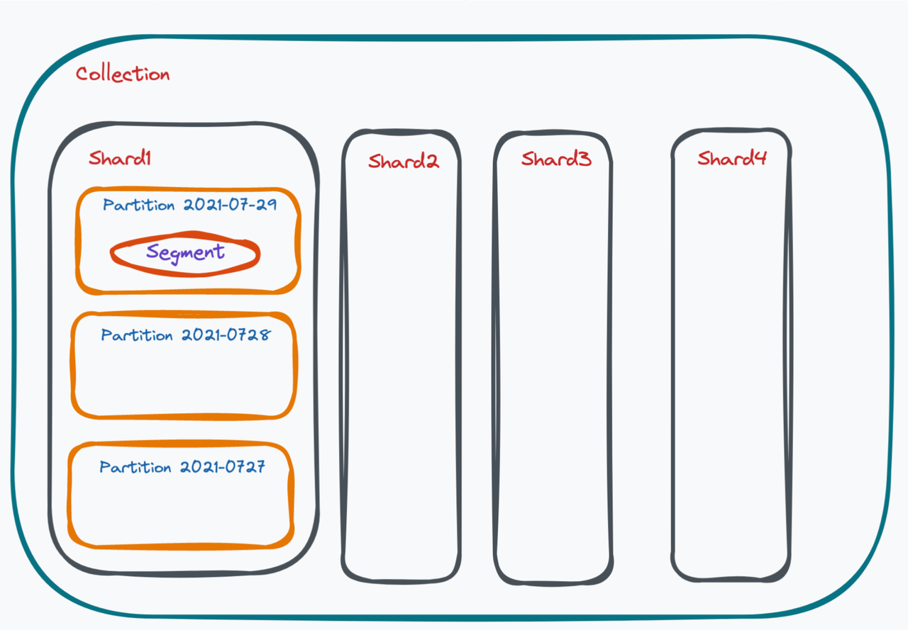
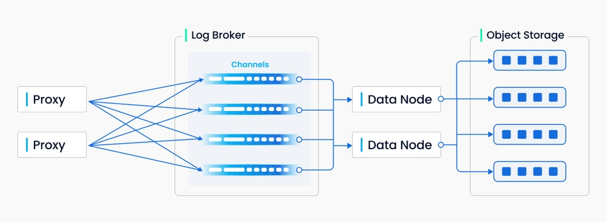
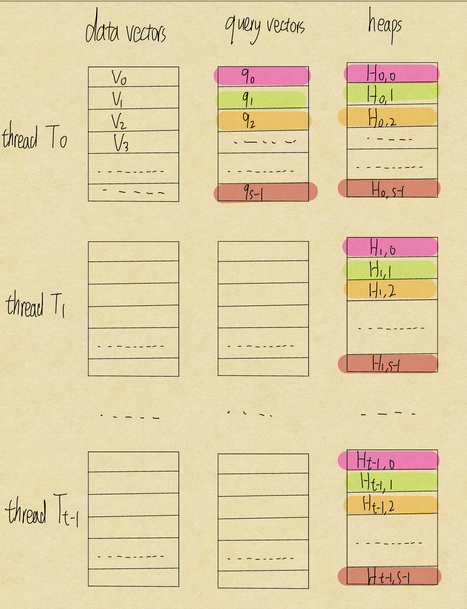
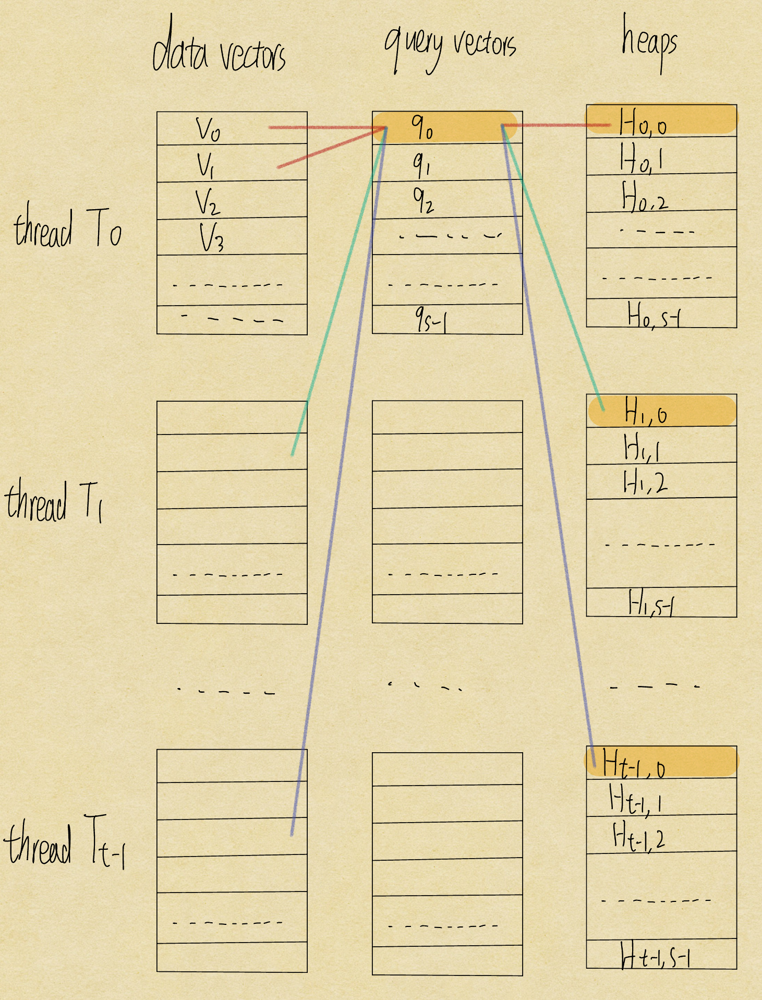

# Milvus

*Milvus* is an open-source vector database built for GenAI applications.

---

## Vector Database

A **Vector Database** stores and indexes vector embeddings.

### Why We Need Vector Databases

Why do we need Vector DB when we have FAISS?

1. **CRUD Operations** FAISS indexes are largely static. Deleting or updating a single vector is unsupported. Vector DBs support real-time inserts, updates, and deletes gracefully.
2. **Scalability** FAISS runs on a single machine. Vector databases are built for horizontal scaling.
3. **Persistence** FAISS stores indexes in memory. If your process crashes, your index is gone. Vector DBs handle durability automatically.

### How It Works


1. **Indexing**: The vector database indexes vectors using an algorithm such as PQ, LSH, or HNSW. This step enables faster searching.
2. **Querying**: The vector database compares the **indexed query vector** to the **indexed vectors in the dataset** to **find the nearest neighbors**
3. **Post Processing**: In some cases, the vector database retrieves the final nearest neighbors from the dataset and applies a more careful analysis to re-rank them before returning the final result to you.

### Serverless Vector Databases

**Separation of storage from compute:**

The key idea behind separation of storage from compute is to **minimize expensive compute cost**.

Partitioning algorithms can break an index into sub-indices, allowing us to focus the search on specific partitions.

When a vector embedding comes in, the vector embedding is assigned to 1 of the partitions. 

When a query comes in, the system only searches the partition where the result is most likely at. **This minimizes the cost of searching.**


**Freshness:**

*Problem:* Building the index is slow. We could run into freshness problem - we must wait for new data to be correctly stored in the index before we query them.

*Solution:*

Key idea: add a **Freshness Layer** as a **"cache"** of the vector database.

- When new data comes in, it is both sent to the freshness layer for fast retrieval and index builder. Once index builder completed, the data is removed from freshness layer.
- When a new query comes in, it searches both the freshness layer and partitioned index for the result.


---

## Architecture


### Layer 1: Access Layer

Composed of a group of stateless proxies that validates client requests and return results.

### Layer 2: Coordinator

The Coordinator is the brain of Milvus.

Here are some of the responsibilities of the coordinator:

- **DDL/DCL/TSO Management**: Creating or deleting collections, partitions, or indexes.
- **Streaming Service Management**: Binds the Write-Ahead Log (WAL) with Streaming Nodes and provides service discovery for the streaming service.
- **Query Management**: Manages load balancing for the Query Nodes.
- **Historical Data Management**: Distributes offline tasks such as compaction and index-building to Data Nodes.

### Layer 3: Worker Nodes

Worker nodes are dumb executors that follow instructions from the coordinator.

**Streaming Node**

Streaming Node serves as the shard-level **"mini-brain"**, providing shard-level consistency guarantees and fault recovery. Meanwhile, Streaming Node is also responsible for **growing data querying** and generating query plans. Additionally, it also handles the conversion of growing data into sealed (historical) data.

Note: 

1. shard is a horizontal partition of a database.
2. growing data is saved on streaming node.

**Query Node**

Loads and query historical data from storage.

**Data Node**

Handles offline processing of historical data, such as **compaction and index building**.

### Layer 4: Storage

**Meta Storage**

Storing metadata such as collection schema.

**Object Storage**

Object storage stores snapshot files of logs, index files for scalar and vector data, and intermediate query results. Milvus uses MinIO as object storage and can be readily deployed on AWS S3 and Azure Blob, two of the world’s most popular, cost-effective storage services.

**WAL storage**

Storing the logs of every operation for recovery.

### Example Data Flow: Search Operation

1. Client sends a search request

2. Load Balancer routes request to available Proxy in Access Layer

3. Proxy uses routing cache to determine target nodes

4. Proxy forwards request to appropriate Streaming Nodes, which then coordinate with **Query Nodes for sealed data search** while **executing growing data search locally**

5. Query Nodes load sealed segments from Object Storage as needed and perform segment-level search

6. Search results undergo multi-level reduction: Query Nodes reduce results across multiple segments, Streaming Nodes reduce results from Query Nodes, and Proxy reduces results from all Streaming Nodes before returning to client

   Query Nodes ---> Streaming Nodes ---> Proxy Nodes ---> Client

### Example Data Flow: Data Insertion

1. Client sends an insert request with vector data
2. Access Layer validates and forwards request to Streaming Node
3. Streaming Node logs operation to WAL Storage for durability
4. Data is processed in real-time and made available for queries
5. **When segments reach capacity, Streaming Node triggers conversion to sealed segments**
6. Data Node handles compaction and builds indexes on top of the sealed segments, storing results in Object Storage
7. Query Nodes load the newly built indexes and replace the corresponding growing data

---

## Data Storage



**Collection**

A collection in Milvus is like a table in a RDBMS. Collection is the biggest data unit in Milvus.

**Shard**

Shards are horizontal slices of a collection. They are created using the method called sharding - a master key hashing method.

Here's how it works: when there is an operation request from user, the proxy will split the written message into parts which are assigned to multiple streaming nodes based on the hashing algorithm. This is to maximize write throughput.



**Partition**

There are multiple partitions in a shard. A partition in Milvus refers to a set of data marked with the same label in a collection. Common partitioning methods including partitioning by date, gender, user age, and more. 

**Segments**

Within each partition, there are multiple small segments. There are two types of segments, **growing** and **sealed**. Growing segments are subscribed by query nodes. The Milvus user keeps writing data into growing segments. When the size of a growing segment reaches an upper limit, the system will not allow writing extra data into this growing segment, hence sealing this segment. Indexes are built on sealed segments.

To access data in real time, the system reads data in both growing segments and sealed segments.

**Entity**

Each segment contains massive amount of entities. An entity in Milvus is equivalent to a row in a traditional database. Each entity has a unique primary key field. Entities must also contain timestamp, and vector field - the core of Milvus.

---

## Data Persistence

---

## Query Execution

The core vector execution engine is called **Knowhere**. 

Knowhere is designed to support heterogeneous computing. It controls on which hardware (CPU or GPU) to execute index building and search requests. This is how Knowhere gets its name - knowing where to execute the operations.


### Query Types

**Vector Query:** Given a vector, return the k most similar vectors where k is a user-input parameter.

**Attribute Filtering:** Given a vector and some attributes, return the k most similar vectors.

Example: user might want to find similar clothes under $100

**Multi-vector Query:** Given multiple vectors, return the k most similar vectors where k is a user-input parameter.

### Similarity Functions

Users could choose to use one of the commonly used similarity metrics, including Euclidean distance, inner product, cosine similarity and so on.

### Heterogeneous Computing

**CPU-oriented Optimizations**

The fundamental problem of query processing is that, given a collection of m queries {q1, q2, ....., qm} and a collection of n data vectors {v1, v2, ....., vn}, how to quickly find for each query qi its top-k similar vectors.

Steps:

1. Each thread is assigned some data vectors. Assume there are *t* threads.

   The queries are partitioned into blocks of size *s* (assume the total number of queries is divisible by *s*). 

   Each query in the block is assigned *t* heaps. The query with local index *i* is assigned heaps *H0,i*, *H1,i* ......, *Ht-1,i*

   

2. A query block and its associated heaps is loaded into L3 cache.

3. When a thread loads its data vector block into L3 cache, it is compared against the entire query block.

   For a query with local index *j*, a matching vector in thread *i* will be saved to *Hi,j*

   See the below example of how query 0 saves its data:

   

4. Repeat 2 and 3 for the next query block.

5. Now the results of a query *qi* are spread over *i* heaps. We need to merge these heaps to get the final top-k results.

*Advantage of this approach:*

- **It minimizes CPU cache misses** because each part of the data is resued for multiple queries.  
- It assignes threads to data vectors instead of query to **best leverage multi-core parallelism**, because the data size *n* is usually much bigger than the query size *m* in practice.

**GPU-oriented Optimizations**

1. **Supporting bigger k in GPU kernel.**

   When k is greater than 1024 (which means data could not fit into shared memory), Milvus execute the query in multiple rounds to cumulatively produce the final results.

2. **Supporting multi-GPU devices.**

   Milvus allow users to select any number of GPU devices during runtime. For example, if a new GPU is installed, Milvus can immediatley assign the next available search task to it.

**GPU and CPU Co-design**

Milvus has developed a index called SQ8H, which is designed to leverage both GPU and CPU for optimized performance.

```
Algorithm: SQ8H

let n be the number of queries

if n > threshold
		# GPU does all the work
		load data in CPU memory to GPU memory
		run all the queries entirely in GPU
else
		# CPU and GPU cooperate
		execute the step1 of SQ8 in GPU: finding buckets
		execute the step2 of SQ8 in GPU: scanning relevant bucket
```

Since data transfer between CPU and GPU memory is expensive, using GPU only outperforms when the query batch size is large enough. In this cases, the GPU's computational advantage is enough to amortize the overhead of data movement.


