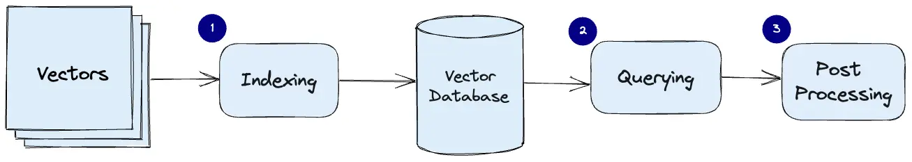
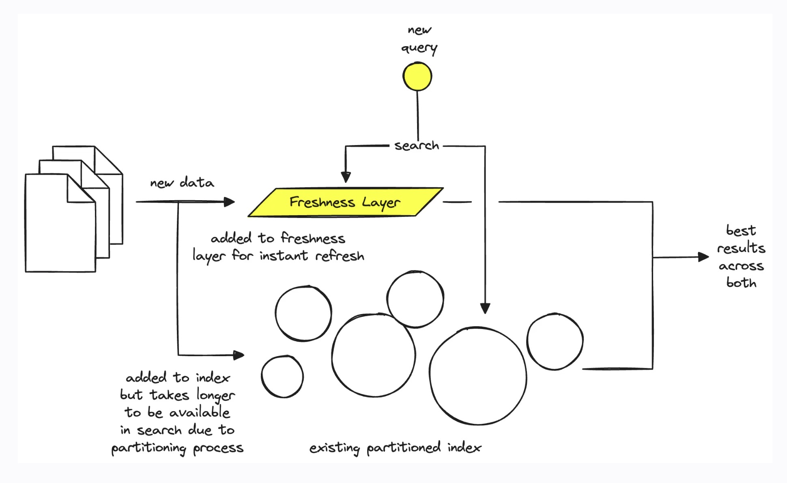
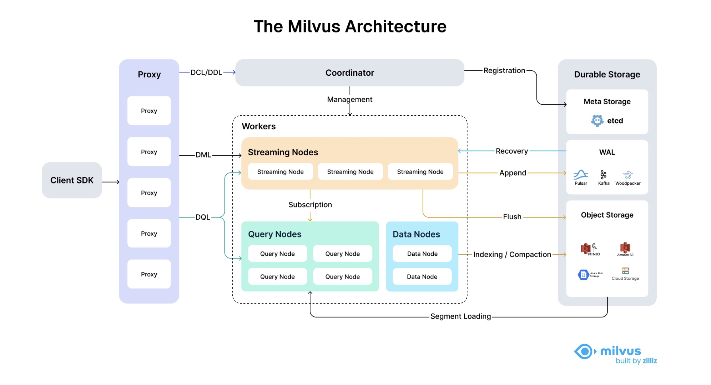
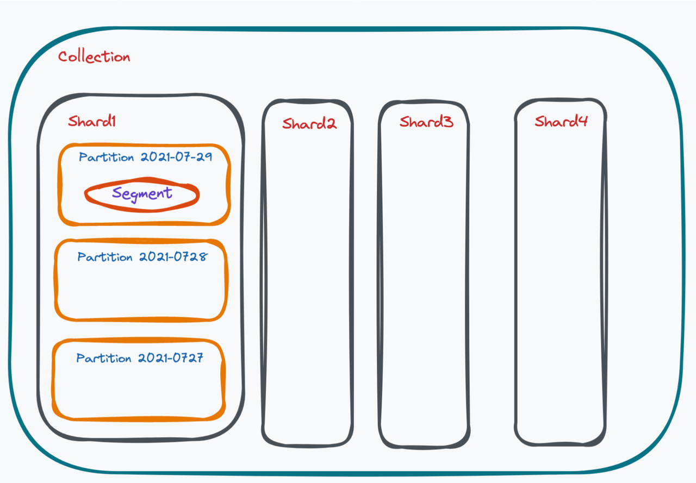
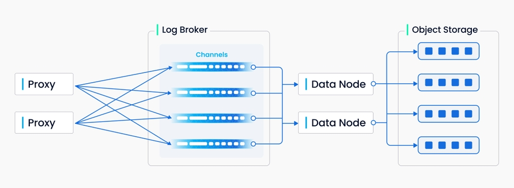
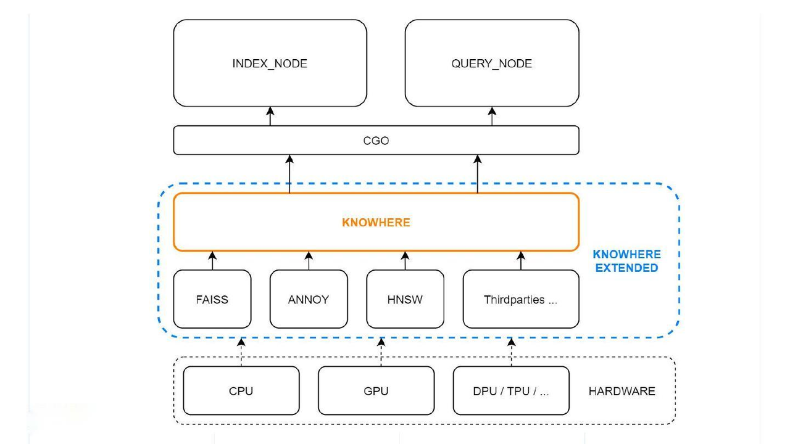

# Milvus

*Milvus* is an open-source vector database built for GenAI applications.

---

## Vector Database Introduction

A **Vector Database** stores and indexes vector embeddings.

### Why We Need Vector Databases

Why do we need Vector DB when we have FAISS?

1. **CRUD Operations** FAISS indexes are largely static. Deleting or updating a single vector is unsupported. Vector DBs support real-time inserts, updates, and deletes gracefully.
2. **Scalability** FAISS runs on a single machine. Vector databases are built for horizontal scaling.
3. **Persistence** FAISS stores indexes in memory. If your process crashes, your index is gone. Vector DBs handle durability automatically.

### How It Works

1. **Indexing**: The vector database indexes vectors using an algorithm such as PQ, LSH, or HNSW. This step enables faster searching.
2. **Querying**: The vector database compares the **indexed query vector** to the **indexed vectors in the dataset** to **find the nearest neighbors**
3. **Post Processing**: In some cases, the vector database retrieves the final nearest neighbors from the dataset and applies a more careful analysis to re-rank them before returning the final result to you.

### Freshness Layer of Vector Database

*Problem:* Building the index is slow. We could run into freshness problem - we must wait for new data to be correctly stored in the index before we query them.

*Solution:*

Key idea: add a **Freshness Layer** as a **"cache"** of the vector database.

- When new data comes in, it is both sent to the freshness layer for fast retrieval and index builder. Once index builder completed, the data is removed from freshness layer.
- When a new query comes in, it searches both the freshness layer and partitioned index for the result.

---

## Architecture

### Layer 1: Access Layer

Composed of a group of stateless proxies that validates client requests and return results.

### Layer 2: Coordinator

The Coordinator is the brain of Milvus.

Here are some of the responsibilities of the coordinator:

- **DDL/DCL/TSO Management**: Creating or deleting collections, partitions, or indexes.
- **Streaming Service Management**: Binds the Write-Ahead Log (WAL) with Streaming Nodes and provides service discovery for the streaming service.
- **Query Management**: Manages load balancing for the Query Nodes.
- **Historical Data Management**: Distributes offline tasks such as compaction and index-building to Data Nodes.

### Layer 3: Worker Nodes

Worker nodes are dumb executors that follow instructions from the coordinator.

**Streaming Node**

Streaming Node serves as the shard-level **"mini-brain"**, providing shard-level consistency guarantees and fault recovery. Meanwhile, Streaming Node is also responsible for **growing data querying** and generating query plans. Additionally, it also handles the conversion of growing data into sealed (historical) data.

**Query Node**

Loads and query historical data from storage.

**Data Node**

Handles offline processing of historical data, such as **compaction and index building**.

### Layer 4: Storage

**Meta Storage**

Storing metadata such as collection schema.

**Object Storage**

Object storage stores snapshot files of logs, index files for scalar and vector data, and intermediate query results. Milvus uses MinIO as object storage and can be readily deployed on AWS S3 and Azure Blob, two of the world’s most popular, cost-effective storage services.

**WAL storage**

Storing the logs of every operation for recovery.

### Example Data Flow: Search Operation

1. Client sends a search request

2. Load Balancer routes request to available Proxy in Access Layer

3. Proxy uses routing cache to determine target nodes

4. Proxy forwards request to appropriate Streaming Nodes, which then coordinate with **Query Nodes for sealed data search** while **executing growing data search locally**

5. Query Nodes load sealed segments from Object Storage as needed and perform segment-level search

6. Search results undergo multi-level reduction: Query Nodes reduce results across multiple segments, Streaming Nodes reduce results from Query Nodes, and Proxy reduces results from all Streaming Nodes before returning to client

   Query Nodes ---> Streaming Nodes ---> Proxy Nodes ---> Client

### Example Data Flow: Data Insertion

1. Client sends an insert request with vector data
2. Access Layer validates and forwards request to Streaming Node
3. Streaming Node logs operation to WAL Storage for durability
4. Data is processed in real-time and made available for queries
5. **When segments reach capacity, Streaming Node triggers conversion to sealed segments**
6. Data Node handles compaction and builds indexes on top of the sealed segments, storing results in Object Storage
7. Query Nodes load the newly built indexes and replace the corresponding growing data

---

## Data Storage

**Collection**

A collection in Milvus is like a table in a RDBMS. Collection is the biggest data unit in Milvus.

**Shard**

Shards are horizontal slices of a collection. They are created using the method called sharding - a master key hashing method.

Here's how it works: when there is an operation request from user, the proxy will split the written message into parts which are assigned to multiple streaming nodes based on the hashing algorithm. This is to maximize write throughput.

**Partition**

There are multiple partitions in a shard. A partition in Milvus refers to a set of data marked with the same label in a collection. Common partitioning methods including partitioning by date, gender, user age, and more. 

**Segments**

Within each partition, there are multiple small segments. There are two types of segments, **growing** and **sealed**. Growing segments are subscribed by query nodes. The Milvus user keeps writing data into growing segments. When the size of a growing segment reaches an upper limit, the system will not allow writing extra data into this growing segment, hence sealing this segment. Indexes are built on sealed segments.

To access data in real time, the system reads data in both growing segments and sealed segments.

**Entity**

Each segment contains massive amount of entities. An entity in Milvus is equivalent to a row in a traditional database. Each entity has a unique primary key field. Entities must also contain timestamp, and vector field - the core of Milvus.

---

## Indexes

Milvus mainly support two types of indexes: **quantization-based indexes** (including IVF_FLAT, IVF_SQ8, and IVF_PQ) and **graph-based indexes** (including HNSW and RNSG) to serve different applications. 

Considering there are many new indexes coming out every year, Milvus is designed to easily incorporate new indexes with a high-level abstraction. Developers only need to implement a few pre-defined interfaces for adding a new index. 

---

## Compression

Milvus supports index-level compression and compaction of small segments into larger ones. However, compressing raw vector data is not supported.

---

## Concurrency Control

Milvus supports Multi-Version Concurrency Control. 

Milvus provides a Timestamp Oracle (TSO) service to ensure global ordering, meaning all events must be allocated a timestamp from TSO rather than from the local clock.

---

## Checkpoint

Incoming data is first stored in **growing segments** in streaming nodes. After the growing segment reaches a threshold, it is sealed and becomes **sealed segment**. Milvus will do a checkpoint by flushing these sealed segment to Object Storage.

---

## Query Execution

The core vector execution engine is called **Knowhere**. 

Knowhere is an operation interface between services in the upper layers of the system and vector similarity search libraries like [Faiss](https://github.com/facebookresearch/faiss), [Hnswlib](https://github.com/nmslib/hnswlib), [Annoy](https://github.com/spotify/annoy) in the lower layers of the system. In addition, Knowhere is also in charge of heterogeneous computing. More specifically, Knowhere controls on which hardware (eg. CPU or GPU) to execute index building and search requests. This is how Knowhere gets its name - knowing where to execute the operations.

Knowhere only processes data computing tasks, while tasks like sharding, load balance, disaster recovery are beyond the work scope of Knowhere.

Knowhere has the following advantages compared to FAISS:

1. **Support for BitsetView:** bitset was introduced to enable "soft deletion". More specifically, a soft-deleted vector will still exist in the database, but it would not be computed during a vector query. 
2. **Support for AVX512 instruction set:** Knowhere supports [AVX512](https://en.wikipedia.org/wiki/AVX-512), which can [improve the performance of index building and query by 20% to 30%](https://milvus.io/blog/milvus-performance-AVX-512-vs-AVX2.md) compared to AVX2.
3. **Automatic SIMD-instruction selection:** At run time, Knowhere could choose the best suited SIMD-instructions based on the current CPU.

---

## References

[What is a Vector Database & How Does it Work? Use Cases + Examples](https://www.pinecone.io/learn/vector-database/)

[Building a Vector Database for Scalable Similarity Search](https://milvus.io/blog/deep-dive-1-milvus-architecture-overview.md)

[How to Compact Data in Milvus?](https://milvus.io/blog/2022-2-21-compact.md)

[What Powers Similarity Search in Milvus Vector Database?](https://milvus.io/blog/deep-dive-8-knowhere.md)

[Milvus: A Purpose-Built Vector Data Management System](https://www.cs.purdue.edu/homes/csjgwang/pubs/SIGMOD21_Milvus.pdf)
