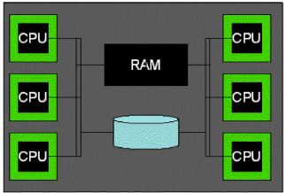
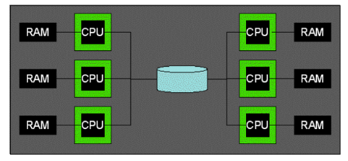
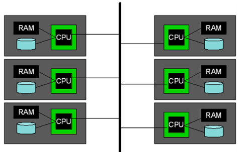
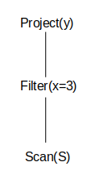
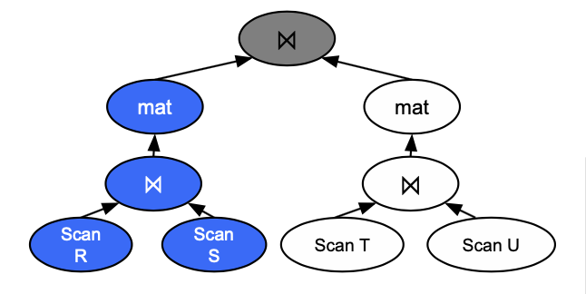
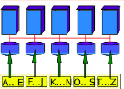
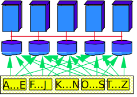
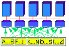

# Parallel Query Processing

---

## Parallel Architectures

### Shared Memory

### Shared Disk

### Shared Nothing

---

## Types of Inter-operator Parallelism

**Definition:** Inter-operator Parallelism is making a query run as fast as possible by running the operators in parallel.

### Pipeline Parallelism

In pipeline parallelism records are passed to the parent operator as soon as they are done. The parent operator can work on a record that its child has already processed while the child operator is working on a different record.

**Example:**

In the above example, the project and filter can run at the same time because as soon as filter finishes a record, project can operate on it while filter picks up a new record to operate on.

### Bushy Tree Parallelism

Different branches of the tree are run in parallel.

**Example:**

In the above example, the left branch and right branch can execute at the same time.

---

## Partitioning

Because all of our machines have their own disk we have to decide what data is stored on what machine.

## Range Partitioning

In a **range partitioning** scheme each machine gets a certain range of records that it will store.

Think of it like a set of encyclopedia volumes on a shelf. Instead of one massive book, you have multiple volumes organized by a range of letters:

- **Volume 1:** A–E
- **Volume 2:** F–L
- **Volume 3:** M–S
- **Volume 4:** T–Z

This scheme is very good for queries that lookup on a specific key, especially range queries. Because in **Range Partitioning**, logically adjacent values are physically adjacent.

## Hash Partitioning

In a **hash partitioning** scheme, each record is hashed and is sent to a machine matches that hash value.

It will still perform well for key lookup, but not for range queries. Because the hash function is designed to be **random**, there is no relationship between the input value and the partition location.

## Round Robin Partitioning

In this scheme we go record by record and assign each record to the next machine. For example the first record will be assigned to the first machine, the second record will be assigned to the second machine and so on.

Every machine is guaranteed to get the same amount of data, so this scheme will actually achieve maximum parallelization.
