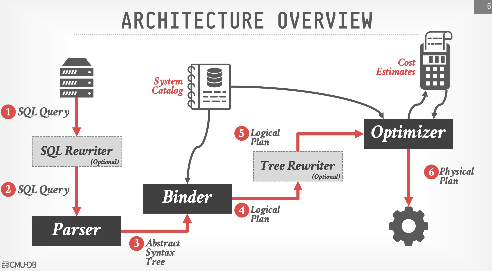

# Query Optimizer

For a given query, how to come up with the most optimized way to run the query?

---

## Overview



---

## Design Decisions

When designing a query optimizer, you need to consider 5 things: Optimization Granularity, Optimization Timing, Prepared Statements, Plan Stability, and Search Termination.

### Optimization Granularity

What is the scope of my optimization search?

**Choice 1: single query** (most common)

This has much smaller search space for optimizer.

**Choice 2: multiple queries**

This is more efficient if there are many similar queries (useful for data sharing).

### Optimization Timing

When to apply this optimization?

**Choice #1: Static Optimization** (most common)

Select the best plan prior to execution. The optimized plan quality is dependent on cost model accuracy.

**Choice #2: Dynamic Optimization** (good for data lakes where you do not have statistics on the data in your storage)

Select operator plans as queries execute. Optimization plan will be rewrite during run time. This is difficult to implement.

**Choice #3: Adaptive Optimization**

Generate a query plan. If the query plan does not work well (discovered during execution), let the optimizer rewrite the query plan.

### Prepared Statements

Recap what a prepared statement is:

```
PREPARE myQuery(int, int, int) AS 
SELECT A.id, B.val
FROM A, B, C
WHERE A.id = B.id
AND B.id = C.id
AND A.val > 100
AND B.val > 99
AND C.val > 5000
PREPARE myQuery AS
SELECT A.id, B.val
FROM A, B, C
WHERE A.id = B.id
AND B.id = C.id
AND A.val > 100
AND B.val > 99
AND C.val > 5000

EXECUTE myQuery(100, 99, 5000); // myQuery is a prepared statement
```

How should query optimizer generate a query plan for a prepared statement? Because if I generate a query plan every time I run a prepared statement, it defeats the purpose of having a prepared statement in the first place. 

**Choice #1: Reuse Last Plan** (Postgres)

Use the plan generated for the previous invocation.

**Choice #2: Multiple Plans** (SQL Server)

Generate multiple plans for different values of the parameters.

**Choice #3: Average Plan**

Choose an average value of a parameter and use that for all invocations.

### Plan Stability

The key idea is: the same query should have the same execution every time. It shouldn't be super fast one day and super slow the other day, otherwise this might cause confusions for the engineers and users.

Therefore, the query optimizer should be consistent about the query plan they generated.

**Choice #1: Hints**

Allow users to provide hints to the optimizer. 

Example:

```sql
SELECT /*+ LEADING(o) USE_NL(c) INDEX(o idx_orders_date) PARALLEL(4) */ # This is a hint
    c.customer_name,
    o.order_date,
    o.total_amount
FROM orders o
JOIN customers c ON o.customer_id = c.customer_id
WHERE o.order_date >= DATE '2025-01-01'
  AND o.total_amount > 1000;
```

**Choice #2: Fixed Optimizer Versions**

We could assign specific versions of optimizer to specific queries.

For example, Oracle uses multiple versions of optimizers. They could say: "oh, for this set of queries, version 15 generates the best plan than all other queries. Use that optimizer for those plans."

**Choice #3: Backwards Compatible-Plans**

Save query plan for old version and use it in new version.

### Search Termination

**Approach #1: Wall-clock Time**

Stop after the optimizer runs for some length of time. 

**Approach #2: Cost Threshold**

Stop when the optimizer finds a plan that has a lower cost than some threshold. 

**Approach #3: Exhaustion**

Stop when there we have explored every possible way to construct a query plan.

---


