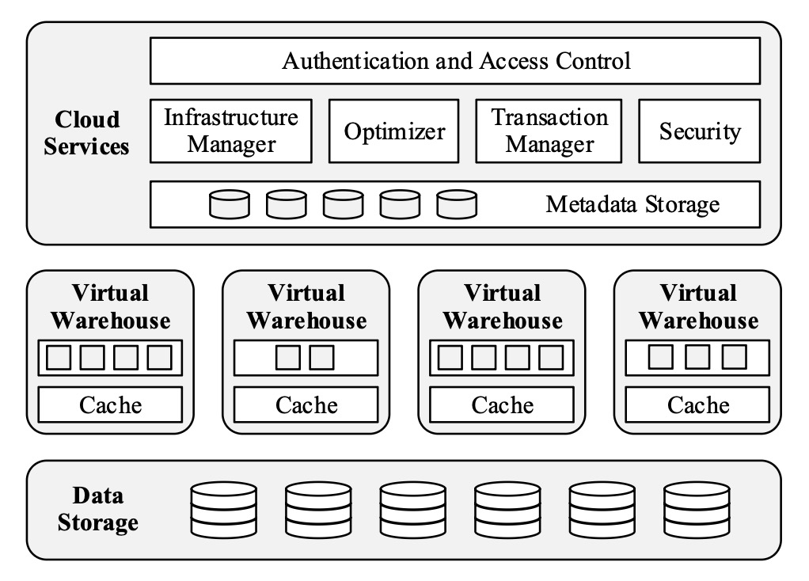
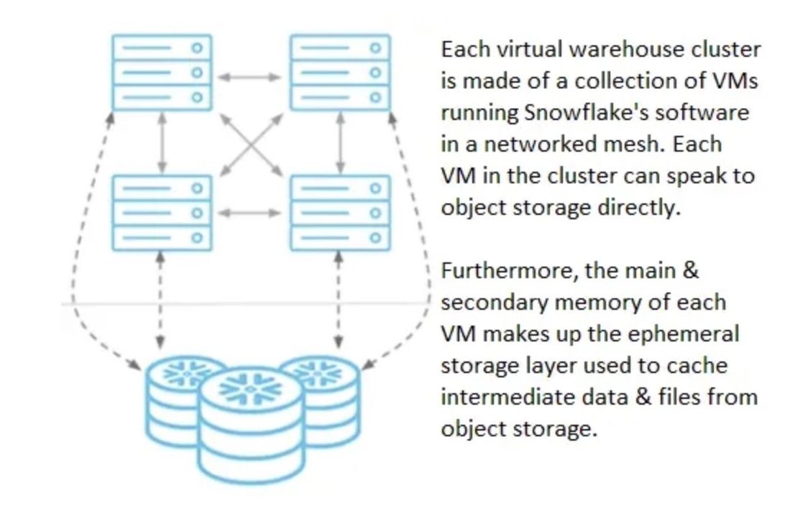

# Snowflake

Snowflake represents the pioneering cloud-native OLAP database in the commercial sphere.

---

## Architecture

### Database Storage

Snowflake supports the following kinds of data:

- *Structured data* — such as rows and columns in a table — follows a strict tabular schema.
- *Semi-structured data* — such as a JSON file or an XML file — has a flexible schema.
- *Unstructured data* — such as a document, image, or audio file — has no inherent schema.

### Compute

A *virtual warehouse* is a cluster of compute resources in Snowflake. Each virtual warehouse is an independent compute cluster that doesn’t share compute resources with other virtual warehouses. As a result, each virtual warehouse has no effect on the performance of other virtual warehouses.

Note: well, to understand the following image, think about this analogy: VM -> SM, object storage -> global memory, VM's memory -> shared memory.

### Cloud Services

The cloud services layer runs on compute instances from the cloud provider.

---

