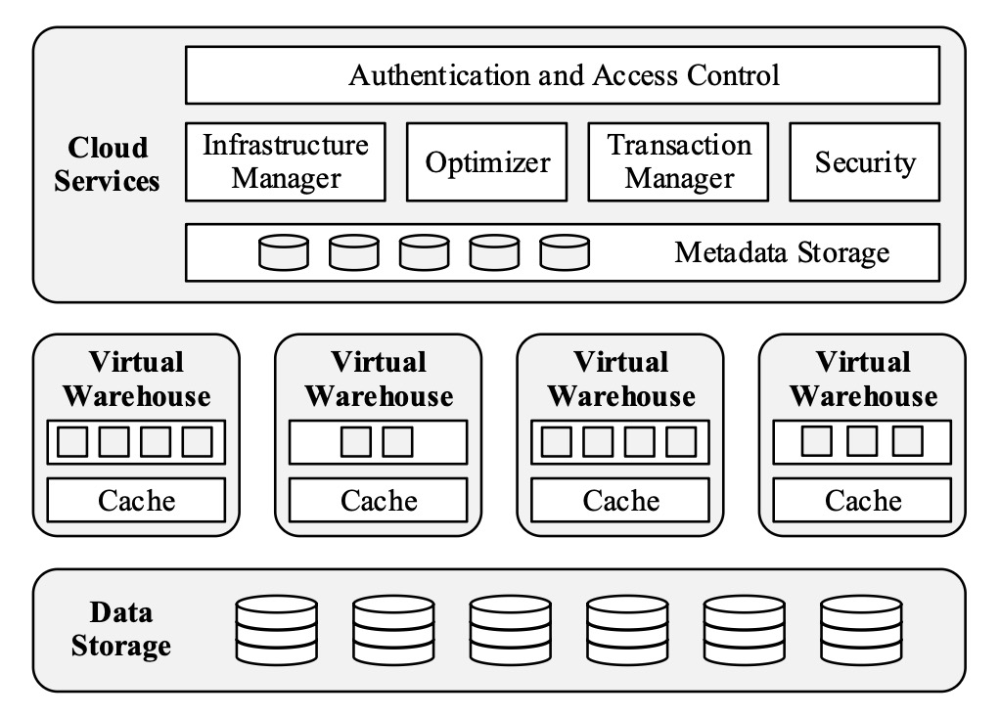
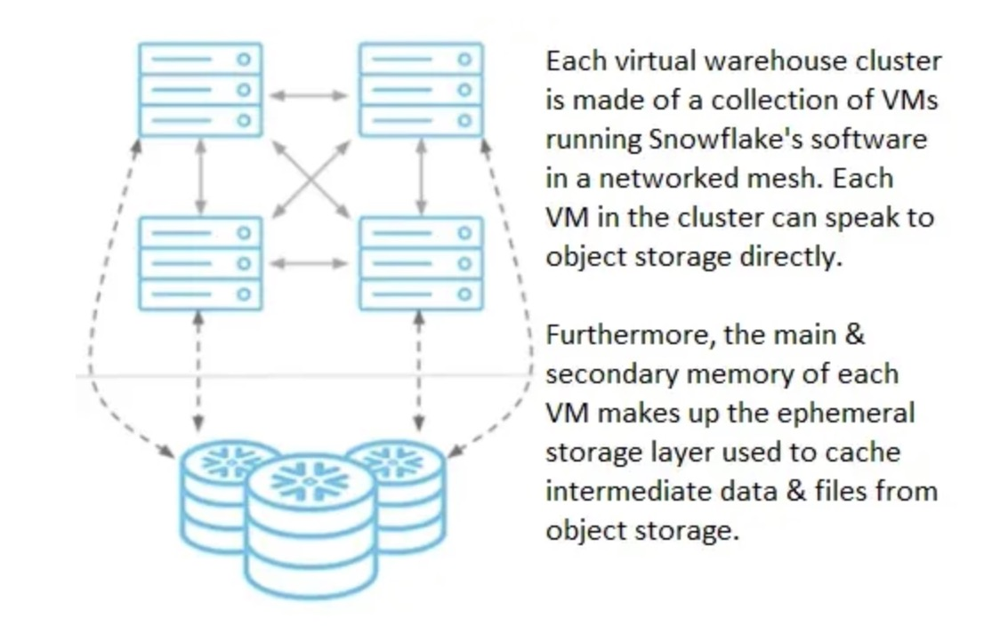
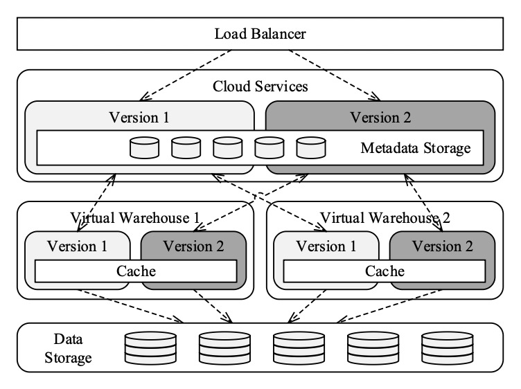

# Snowflake

Snowflake represents the pioneering cloud-native OLAP database in the commercial sphere.

---

## Architecture

Snowflake uses a hybrid architecture of both shared-nothing and shared-disk.

- Shared-nothing: each VW has its own disk as cache
- Shared-disk: for separating storage with compute.

*Question: why not pure shared-nothing?*

*Answer: the pure shared-nothing architecture has an important drawback - it tightly couples compute with storage.*

1. *if the sets of node changes, large amount of data needs to be moved to new nodes.*
2. *when you're upgrading a node, you couldn't use its data.* 
3. *you couldn't use specialized nodes to do specific workloads (for example, high I/O bandwidth and light compute)*

### Database Storage

Snowflake supports the following kinds of data:

- *Structured data* — such as rows and columns in a table — follows a strict tabular schema.
- *Semi-structured data* — such as a JSON file or an XML file — has a flexible schema.
- *Unstructured data* — such as a document, image, or audio file — has no inherent schema.

### Compute

A *virtual warehouse* is a cluster of virtual machines in Snowflake. Each virtual warehouse is an independent compute cluster that doesn’t share compute resources with other virtual warehouses. For example, each individual query runs on exactly one VW. As a result, each virtual warehouse has no effect on the performance of other virtual warehouses. Users does not know how many EC2 instances make up the VW.

**Performance:** 

To improve cache hit rate, the query optimizer assigns input file sets to worker nodes using consistent hashing over file names. Therefore, the queries accessing the same table files will be done on the same worker node. 

When there's a EC2 instance failure, the data stays in the cache, and Snowflake uses a LRU replacement policy to eventually replace the contents. This ensures better availability and simplifies the system.

To solve skew handling, worker nodes could help other worker nodes process files. This is called file stealing.

### Cloud Services

This layer contains a collection of services that manage virtual warehouses, queries, transaction, and metadata about database schemas, usage statistics, etc. The metadata is stored in a transactional key-value store.

---

## Feature Highlights

### Continuous Availability

**Fault resilience:** 

Storage and cloud services uses nodes in "availability zones", which ensures 99.99% data availability and durability.

VWs are not distributed across AZs. This is because high network throughput is critical for distributed query execution, and network throughput is significantly higher in the same AZ.

**Online upgrades:**

The system is designed to allow multiple versions of the various services to be deployed together, because all services are stateless.

Steps for software update:

1. Deploy the new version alongside the previous version.
2. User accounts are moved to new version. New queries will be issued by new version, and the existing queries are allowed to run to completion. 
3. Once all queries and users have finished using the previous version, all services of that version is terminated.

### Time Travel and Cloning

Users are allowed to use earlier versions of the tables.

**MVCC:** copy of every changed database object is preserved for some duration. This is a natural choice given the fact that table files are immutable in S3. In S3, changes to a file can only be made by replacing it with a new file. File additions and removals are tracked in the metadata in the global key-value store. Therefore, creating files related to a new version is very efficient.

Users could also clone a new table. Internally, Snowflake copies the metadata of the source table. Right after cloning, both tables refer to the same set of files, but both tables can be modified independently afterwards.
