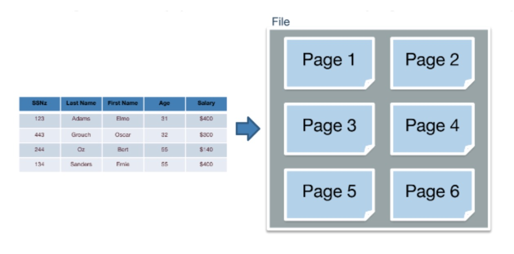
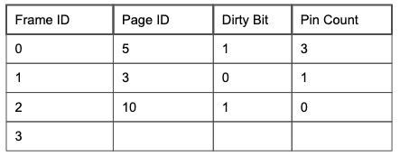
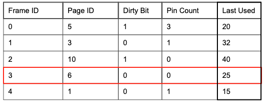
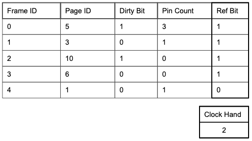
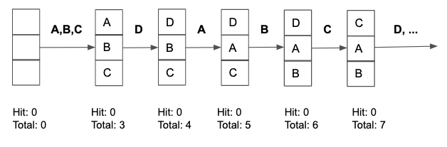
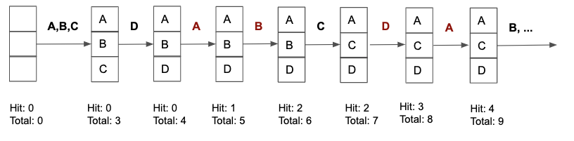
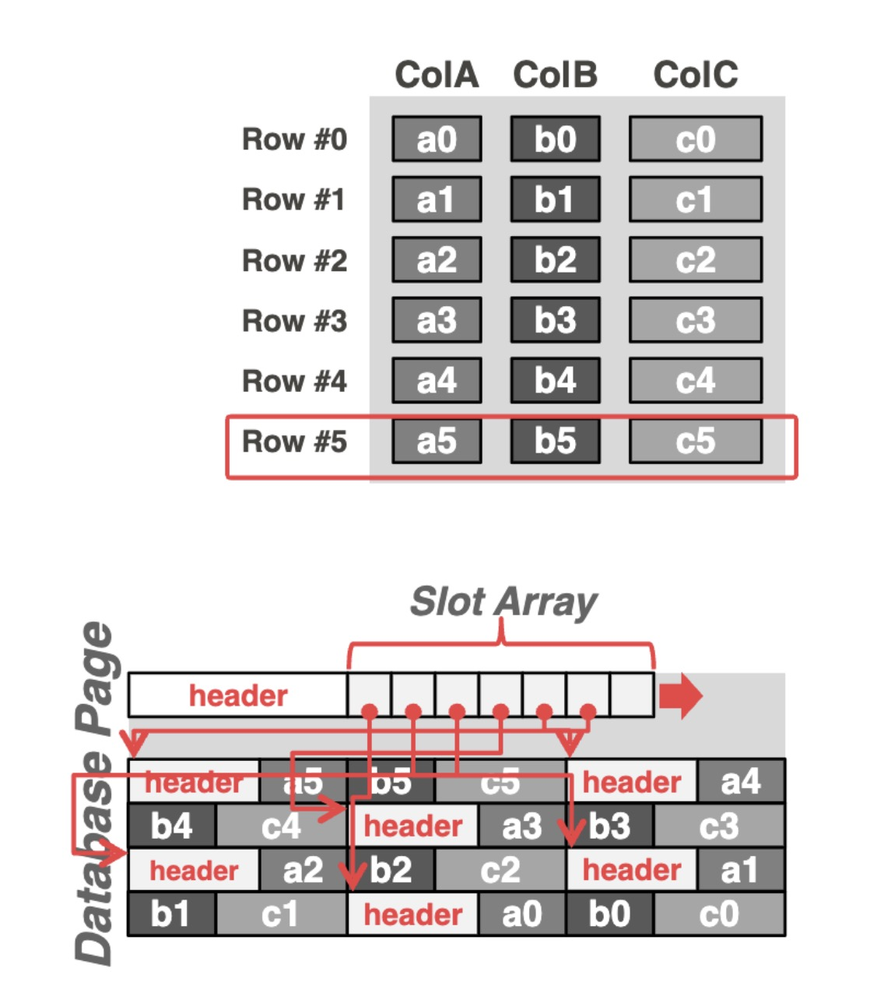
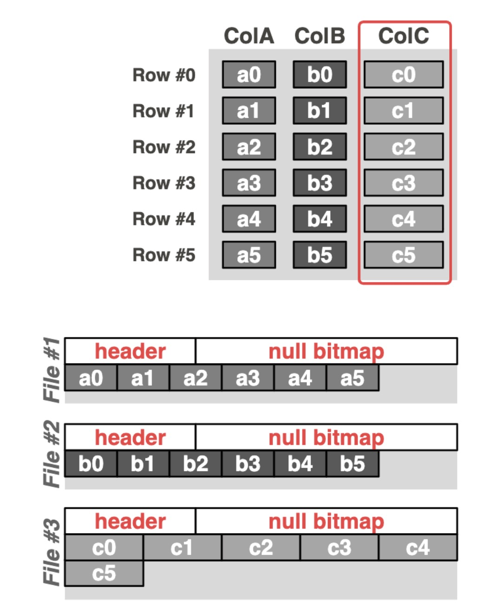

# File Storage

---

## Key Terminology

| Term | Definition |
|------|------------|
| **Record** | A single row in a table |
| **Relation** | A table (collection of records with the same schema) |
| **Page** | The basic unit of data transfer between disk and memory (typically 4KB-8KB) |



---

## File Types

A **file type** refers to the method used to organize pages and records on disk. The choice of file type affects the performance of insert, delete, and search operations.

### Heap File

A **heap file** has no particular ordering of pages or records within pages. Records are inserted wherever there is free space.

#### Linked List Implementation

In the linked list implementation, each data page contains:
- **Records** (the actual data)
- **Free space tracker** (how much space remains)
- **Pointers** (byte offsets to the next and previous pages)

A **header page** acts as the entry point and maintains two separate linked lists:
1. **Free pages** — pages with available space for new records
2. **Full pages** — pages that are completely filled

When a free page becomes full, it is moved to the front of the full pages list.


#### Page Directory Implementation

Instead of linking all data pages together, the page directory uses a **linked list of header pages only**. Each header page entry contains:
- A **pointer** to a data page
- The **amount of free space** remaining in that data page

This approach eliminates the need for data pages to store pointers to neighboring pages, and allows faster location of pages with available space.


### Sorted File

A **sorted file** maintains pages in order, with records within each page sorted by one or more keys. Sorted files are typically implemented using page directories.

### Heap Files vs Sorted Files

| Operation | Heap File | Sorted File |
|-----------|-----------|-------------|
| **Insert** | Fast — place anywhere with space | Slow — must maintain sort order |
| **Search (equality)** | Slow — requires full scan | Fast — can use binary search |
| **Search (range)** | Slow — requires full scan | Fast — records are contiguous |

---

## Record Types

Records are classified by whether their size is fixed or variable.

### Fixed Length Records (FLR)

FLRs contain only fixed-size fields (e.g., `INTEGER`, `BOOLEAN`, `DATE`, `CHAR(n)`). Every record of the same schema occupies the same number of bytes.

### Variable Length Records (VLR)

VLRs contain at least one variable-size field (e.g., `VARCHAR`, `TEXT`, `BLOB`). Records of the same schema can have different byte lengths depending on the actual data stored.

---

## Buffer Management

The **Buffer Manager** is the software component responsible for moving data between the physical disk (storage) and the main memory (RAM).

### Buffer Pool

A **buffer pool** acts as an intermediary layer of memory (RAM) between the database engine and the physical storage (Disk).

When a user or application requests a specific piece of data (a "page"), the database looks to see if the required page is already in the RAM buffer. If the page is found, it is read directly from memory. If the page is not in memory, the DBMS must fetch it from the disk, load it into the buffer pool, and then return it to the user. If the buffer pool is full, the DBMS must "evict" (remove) an old page to make room for the new one.

- Note: When you try to understand buffer pool, just think about how RAM works.

Memory is converted into a buffer pool by partitioning the space into frames that pages can be placed in. A buffer frame can hold the same amount of data as a page can (so a page fits perfectly into a frame). To efficiently track frames, the buffer manager allocates additional space in memory for a metadata table.



The table tracks 4 pieces of information:

1. Frame ID that is uniquely associated with a memory address

2. Page ID for determining which page a frame currently contains

3. Dirty Bit for verifying whether or not a page has been modified

4. Pin Count for tracking the number of requestors currently using a page

### Handling Page Requests

**On page request:**

If a user requested a page, buffer pool checks the following:

```
Page in memory?
├─ Yes → Increment pin count, return address
└─ No → Empty frame available?
         ├─ Yes → Load page into frame, set pin count = 1, return address
         └─ No → Evict a page using replacement policy, then load
```

**On eviction:** If dirty bit = 1, write page to disk first (then reset dirty bit to 0).

**On request completion:** Requestor must decrement the pin count.

### LRU Replacement and Clock Policy

**LRU Policy:** When new pages need to be read into a full buffer pool, the least recently used page which has pin count = 0 and the lowest value in the Last Used column is evicted.



**LRU Policy:**

The Clock policy algorithm treats the metadata table as a circular list of frames. It sets the clock hand to the first unpinned frame upon start and **sets the ref bit on each page’s corresponding row to 1 when it is initially read into a frame**.

When the Clock hand reaches a page frame:

```
                    [Clock hand reaches frame]
                              │
                              ▼
                    ┌─────────────────┐
                    │ pin_count > 0 ? │
                    └─────────────────┘
                       │           │
                      YES          NO
                       │           │
                       ▼           ▼
              ┌──────────────┐  ┌─────────────┐
              │ Skip frame,  │  │ ref_bit = 1?│
              │ move to next │  └─────────────┘
              └──────────────┘     │        │
                                  YES       NO
                                   │        │
                                   ▼        ▼
                          ┌────────────┐  ┌─────────────┐
                          │ Clear bit  │  │ Evict this  │
                          │ (set to 0),│  │    page     │
                          │ move next  │  └─────────────┘
                          └────────────┘
                          (second chance)
```



**LRU Policy Downside:**

LRU performs well overall but performance suffers when a set of pages S, where |S| > buffer pool size, are accessed multiple times repeatedly.

Example:

Sequential scan is a simple loop that iterates through every block on disk to find matches for a query.



### MRU Replacement

Instead of evicting the least recently used unpinned page, evict the most recently used unpinned page measured by when the page’s pin count was last decremented.



MRU far outperforms LRU in terms of page hit rate whenever a sequential flooding access pattern occurs.

---

## Storage Models

### N-ary Storage Model

The **N-ary Storage Model (NSM)** is a database storage architecture where the DBMS stores nearly all attributes for a single tuple contiguously within a page.



### Decomposition Storage Model

The **Decomposition Storage Model (DSM)** is a database storage architecture that stores a single attribute for all tuples contiguously within a block of data.

In other words, DSM is a **column-based storage architecture**.



### PAX Storage Model

**Partition Attributes Across (PAX)** is a hybrid storage model that vertically partitions attributes within a page.

PAX keeps the data on the same logical page but reorganizes the data **inside** that page to be column-oriented.

*Example:*

Imagine a database page storing two users: `{ID: 1, Name: "A", Age: 20}` and `{ID: 2, Name: "B", Age: 30}`.

**PAX (Hybrid) Page Layout:** Data is column-oriented *within* the row-oriented page.

```tex
| PAGE HEADER |
| offset_ID   | -> [ ID:1 | ID:2 ]      (Minipage 1)
| offset_Name | -> [ Name:A | Name:B ]  (Minipage 2)
| offset_Age  | -> [ Age:20 | Age:30 ]  (Minipage 3)
```

### HTAP Storage Model

**HTAP (Hybrid Transaction/Analytical Processing)** is a single system that can handle high-throughput transactions (OLTP) and complex analytical queries (OLAP) simultaneously on the same data.

There are two strategies to achieve this:

#### Fractured Mirror

**Mirror A (Primary/NSM):** Incoming transactions are first stored in **Row Store**. This provides faster writes and updates.

**Mirror B (Secondary/DSM):** The data are then copied to a **Column Store**. Analytical queries are routed here to take advantage of scan speeds and cache locality.

#### Delta Store

**Delta Store (NSM):** Incoming transactions are first stored in **Row Store**.

**Historical Data (DSM):** The data are then copied to a **Column Store**.

*Difference between Fractured Mirror and Delta Store: For fractured mirror, data stores in **both mirrors**. In Delta store, data is **either stored in row store or column store**.*
