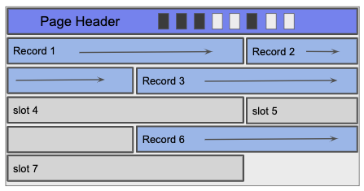
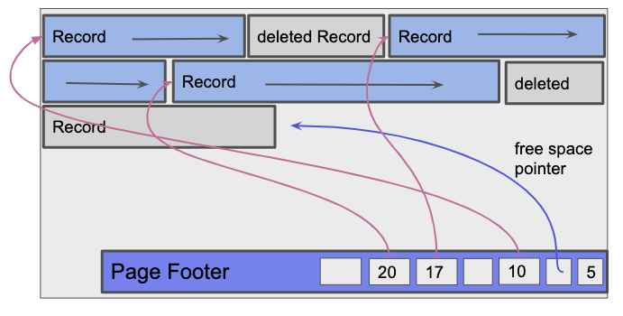

# File Storage

## Key Terminology

| Term | Definition |
|------|------------|
| **Record** | A single row in a table |
| **Relation** | A table (collection of records with the same schema) |
| **Page** | The basic unit of data transfer between disk and memory (typically 4KB-8KB) |

---

## File Types

A **file type** refers to the method used to organize pages and records on disk. The choice of file type affects the performance of insert, delete, and search operations.

### Heap File

A **heap file** has no particular ordering of pages or records within pages. Records are inserted wherever there is free space.

#### Linked List Implementation

In the linked list implementation, each data page contains:
- **Records** (the actual data)
- **Free space tracker** (how much space remains)
- **Pointers** (byte offsets to the next and previous pages)

A **header page** acts as the entry point and maintains two separate linked lists:
1. **Free pages** — pages with available space for new records
2. **Full pages** — pages that are completely filled

When a free page becomes full, it is moved to the front of the full pages list.

#### Page Directory Implementation

Instead of linking all data pages together, the page directory uses a **linked list of header pages only**. Each header page entry contains:
- A **pointer** to a data page
- The **amount of free space** remaining in that data page

This approach eliminates the need for data pages to store pointers to neighboring pages, and allows faster location of pages with available space.

### Sorted File

A **sorted file** maintains pages in order, with records within each page sorted by one or more keys. Sorted files are typically implemented using page directories.

### Heap Files vs Sorted Files

| Operation | Heap File | Sorted File |
|-----------|-----------|-------------|
| **Insert** | Fast — place anywhere with space | Slow — must maintain sort order |
| **Search (equality)** | Slow — requires full scan | Fast — can use binary search |
| **Search (range)** | Slow — requires full scan | Fast — records are contiguous |

---

## Record Types

Records are classified by whether their size is fixed or variable.

### Fixed Length Records (FLR)

FLRs contain only fixed-size fields (e.g., `INTEGER`, `BOOLEAN`, `DATE`, `CHAR(n)`). Every record of the same schema occupies the same number of bytes.

### Variable Length Records (VLR)

VLRs contain at least one variable-size field (e.g., `VARCHAR`, `TEXT`, `BLOB`). Records of the same schema can have different byte lengths depending on the actual data stored.

---

## Page Formats

The internal structure of a page depends on whether it stores fixed or variable length records.

### Pages with Fixed Length Records

Pages containing FLRs use a **page header** that stores:
- The **number of records** currently on the page

Since all records are the same size, the location of the *n*th record can be calculated directly: `offset = header_size + (n × record_size)`.

### Pages with Variable Length Records

Pages containing VLRs use a **page footer** with a **slot directory** that tracks:
- **Slot count** — number of record slots
- **Free space pointer** — offset to the start of free space
- **Slot entries** — each entry contains the offset and length of a record

The footer grows upward from the bottom of the page, while records are inserted from the top downward. This allows both to grow toward the middle without predetermining their sizes.

