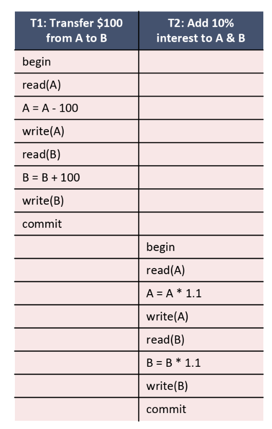
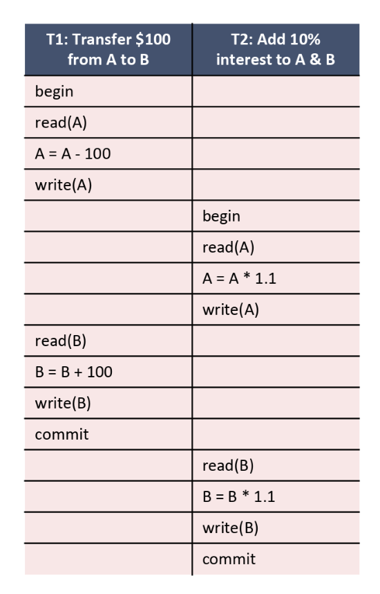
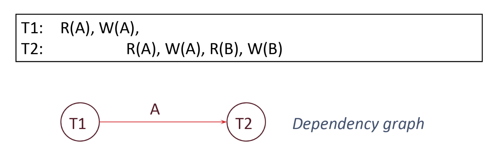
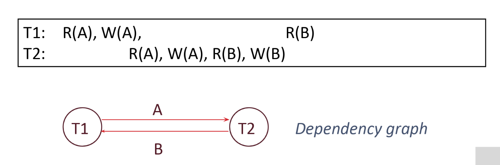
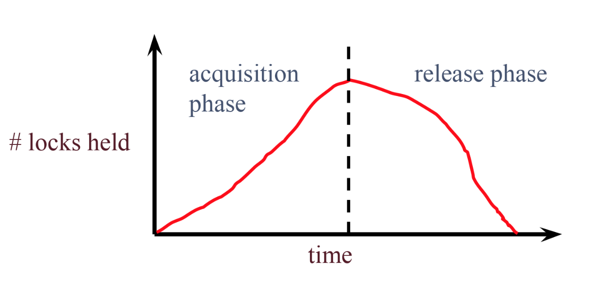
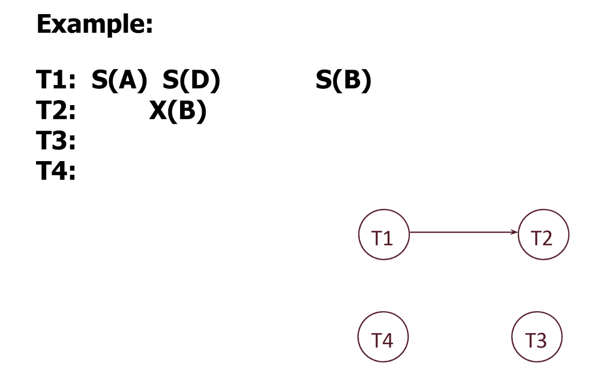
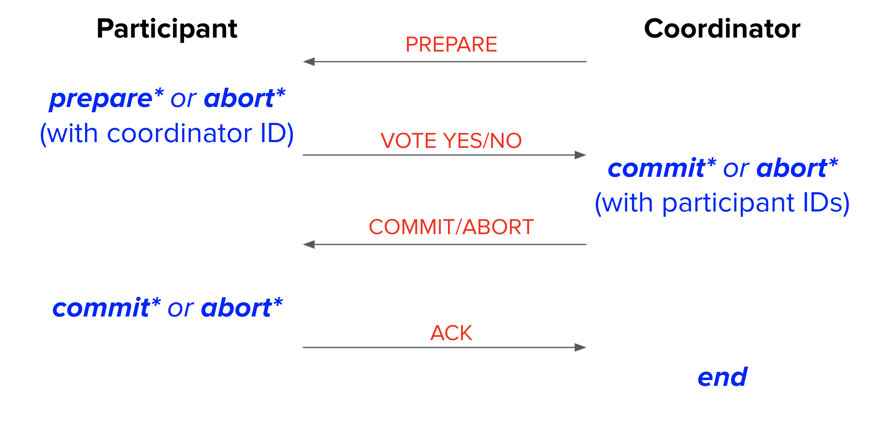
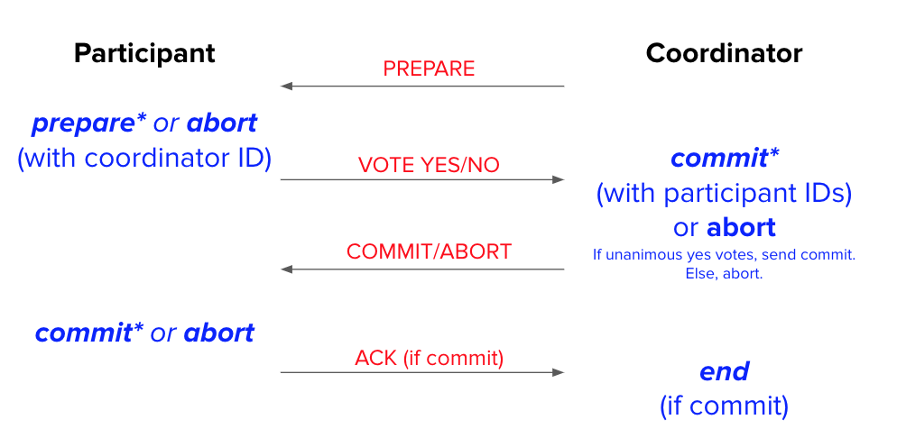

# Transactions

## Overview

A **transaction** is a sequence of one or more database operations that are executed as a single logical unit of work. Transactions guarantee ACID properties to ensure data integrity and consistency even when multiple users access the database concurrently.

## Concurrency Issues

When multiple transactions execute concurrently without proper control, several problems can arise:

### Inconsistent Reads (Write-Read Conflict)

A transaction reads only part of what another transaction has updated, seeing the database in an intermediate state.

**Example:**
- User 1 updates Table 1 and then updates Table 2
- User 2 reads Table 2 (not yet updated by User 1) and then Table 1 (already updated by User 1)
- User 2 sees an inconsistent state of the database

### Lost Update (Write-Write Conflict)

Two transactions try to update the same record at the same time, causing one update to be overwritten.

**Example:**
- User 1 updates a toy's price to be `price × 2`
- User 2 updates the same toy's price to be `price + 5`, overwriting User 1's update
- User 1's update is lost

### Dirty Reads (Write-Read Conflict)

A transaction reads data that was modified by another transaction but never committed (and may be rolled back).

**Example:**
- User 1 updates a toy's price but the transaction gets aborted
- User 2 reads the updated price before User 1's transaction was rolled back
- User 2 has read invalid data

### Unrepeatable Reads (Read-Write Conflict)

A transaction reads the same record twice and gets different values because another transaction modified the record in between.

**Example:**
- User 1 reads a toy's price
- User 2 updates the toy's price to be `price × 2` and commits
- User 1 reads the toy's price again and gets a different value
- User 1 should see the same value within one transaction, so it must abort

## ACID Properties

Transactions guarantee the **ACID properties** to avoid the concurrency problems discussed above:

| Property | Description |
|----------|-------------|
| **Atomicity** | Either all operations in the transaction happen, or none happen. No partial completion. |
| **Consistency** | A transaction takes the database from one valid state to another, maintaining all constraints and rules (e.g., "the banking account balance column cannot be negative"). |
| **Isolation** | Each transaction executes as if it's the only one running. The DBMS may interleave operations from multiple transactions, but each transaction should not see intermediate states of others. |
| **Durability** | Once a transaction is committed, the changes are permanent. Even if the system crashes immediately after, the data persists when the system restarts. |

## Concurrency Control

**Concurrency control** mechanisms ensure that concurrent execution of transactions maintains database consistency and isolation.

### Serial Schedule

A **serial schedule** completes all operations of one transaction before beginning the operations of the next transaction.

**Example:**

### Equivalent Schedules

Two schedules are **equivalent** if they satisfy the following three conditions:

1. They involve the same transactions
2. Operations are ordered the same way within individual transactions
3. They each leave the database in the same final state

### Serializable Schedule

A schedule is **serializable** if its results are equivalent to some serial schedule. This ensures correctness even when operations are interleaved.

**Example:**

The schedule in this example is equivalent to the serial schedule above.

### Conflicting Operations

Two operations **conflict** if they satisfy all three conditions:

1. The operations are from different transactions
2. Both operations operate on the same resource (e.g., same database record)
3. At least one operation is a write

### Conflict Equivalence

Two schedules are **conflict equivalent** if they order all pairs of conflicting operations in the same way.

### Conflict Serializability

A schedule is **conflict serializable** if it is conflict equivalent to some serial schedule. Conflict serializability is a sufficient condition for serializability and can be verified without executing the entire schedule.

## Conflict Dependency Graph

A **dependency graph** (also called a precedence graph) is used to determine whether a schedule is conflict serializable.

### Graph Structure

Dependency graphs have the following structure:

- **One node per transaction**
- **Edge from Ti to Tj** if both conditions are met:
  1. An operation Oi of Ti conflicts with an operation Oj of Tj
  2. Oi appears earlier in the schedule than Oj

### Serializability Test

A schedule is **conflict serializable if and only if its dependency graph is acyclic** (contains no cycles).

**Example 1: Conflict Serializable Schedule**

The dependency graph is acyclic, so this schedule is conflict serializable.

**Example 2: Non-Conflict Serializable Schedule**

The dependency graph contains a cycle, so this schedule is not conflict serializable.

## View Serializability

**View serializability** is an alternate way to determine overall serializability. View serializability will identify more serializable schedules than conflict serializability.

### View Equivalence

Two schedules S1 and S2 are **view equivalent** if they satisfy the following three conditions:

1. **Same initial reads**: The same transactions read the initial values of each data item
2. **Same dependent reads**: If Ti reads a value of X written by Tj in schedule S, it must read the same value written by Tj in S'
3. **Same final writes**: The same transactions perform the final write for each data item

### Blind Writes

The "secret sauce" of view serializability is how it handles **blind writes** (writing to a data item without reading it first).

Conflict serializability often flags schedules with blind writes as "non-serializable" because they create cycles in a precedence graph. However, view serializability recognizes that if a write is "blind" and then immediately overwritten by another "final write," the intermediate conflict doesn't actually change the final outcome of the database.

**Rule of Thumb:** Every conflict serializable schedule is view serializable, but not every view serializable schedule is conflict serializable.

## Lock

### Two Phase Locking

**Two phase locking (2PL)** is a scheme that ensures the database uses conflict serializable schedules. The two rules for 2PL are:

1. Transactions must acquire a **S (shared)** lock before reading, and an **X (exclusive)** lock before writing
2. Transactions cannot acquire new locks after releasing any lock

The problem with this is that it does not prevent **cascading aborts**. For example:

1. T1 updates resource X and then releases the lock on X
2. T2 reads from X
3. T1 aborts
4. T2 must also abort because it read an uncommitted value of X

To solve this, we use **Strict Two Phase Locking (Strict 2PL)**. Strict 2PL is the same as 2PL, except all locks get released together when the transaction commits or aborts.

### Deadlock

#### Avoidance

One way we can get around deadlocks is by trying to avoid getting into a deadlock. We assign the transaction's priority by its age: `now - start time`. If T1 wants a lock that T2 holds, we have two options:

- **Wait-Die**: If T1 has higher priority, T1 waits for T2; else T1 aborts
- **Wound-Wait**: If T1 has higher priority, T2 aborts; else T1 waits

#### Detection

Use a **"waits-for" graph**. This graph will have one node per transaction and an edge from Ti to Tj if all conditions are met:

1. Tj holds a lock on resource X
2. Ti tries to acquire a lock on resource X, but Tj must release its lock on resource X before Ti can acquire its desired lock

If a cycle is found, we will "shoot" a transaction in the cycle and abort it to break the cycle.

### Lock Granularity

#### Hierarchy of Granularity

Locking can happen at various levels within the database. Generally, the levels are structured as follows:

1. **Database Level**: The entire database is locked. Useful for maintenance or backups
2. **Table Level**: An entire table is locked. If User A is updating the "Employees" table, User B cannot even read it
3. **Page/Block Level**: A physical disk block (containing several rows) is locked
4. **Row (Tuple) Level**: Only a specific row is locked. This is the most common level for high-performance databases

#### Multiple Granularity Locking (MGL)

To manage these different levels efficiently, databases use **intent locks**. These signal that a transaction intends to lock something further down the hierarchy:

- **Intent Shared (IS)**: "I intend to place a Shared lock on a row inside this table"
- **Intent Exclusive (IX)**: "I intend to place an Exclusive lock on a row inside this table"
- **Shared Intent Exclusive (SIX)**: "I intend to place an Exclusive lock on a row inside this table, and none of you could modify anything in the table"

This prevents a conflict where User A tries to lock an entire table while User B is currently editing a single row inside it. Without intent locks, the database would have to check every single row to see if it's safe to lock the table.

#### Multiple Granularity Locking Protocol

The protocol follows these rules:

1. Each transaction starts from the root of the hierarchy
2. To get S or IS lock on a node, must hold IS or IX on parent node
3. To get X or IX on a node, must hold IX or SIX on parent node
4. Must release locks in bottom-up order
5. 2-phase and lock compatibility matrix rules enforced as well

The protocol is correct in that it is equivalent to directly setting locks at leaf levels of the hierarchy.

## Distributed Transactions

**Distributed transactions** are needed for executing queries in distributed databases, as a transaction may need to perform reads and writes on data that exist on different nodes.

### Two Phase Commit (2PC)

**Two Phase Commit (2PC)** ensures that in a transaction, either every node succeeds or no one does.

#### Phase 1: Preparation Phase

1. **Coordinator** sends prepare message to participants to tell participants to either prepare for commit or abort
2. **Participants** generate a prepare or abort record and flush record to disk
3. **Participants** send yes vote to coordinator if prepare record is flushed or no vote if abort record is flushed
4. **Coordinator** generates a commit record if it receives unanimous yes votes or an abort record otherwise, and flushes the record to disk

#### Phase 2: Commit/Abort Phase

1. **Coordinator** broadcasts (sends message to every participant) the result of the commit/abort vote based on flushed record
2. **Participants** generate a commit or abort record based on the received vote message and flush record to disk
3. **Participants** send an ACK (acknowledgement) message to the coordinator
4. **Coordinator** generates an end record once all ACKs are received and flushes the record sometime in the future

**Note:** The asterisk `*` in the diagram above means that the node must wait for that log record to flush to disk before sending the next message.

### Distributed Recovery

Suppose a node were to fail at an arbitrary point in the protocol. When this node comes back online, it should still end up making the same decision as all the other nodes in the database. We could recover by looking at our own log and talking to the coordinator node.

#### Recovery Scenarios

**Participant is recovering, and sees no prepare record:**

- This probably means that the participant has not even started 2PC yet – and if it has, it hasn't yet sent out any vote messages (since votes are sent after flushing the log record to disk)
- Since it has not sent out any vote messages, it aborts the transaction locally
- No messages need to be sent out (the participant has no knowledge of the coordinator ID)

**Participant is recovering, and sees a prepare record:**

- This situation is trickier. Looking at the diagram above, a lot of things could have happened between logging the prepare record and crashing – for instance, we don't even know if we managed to send out our YES vote!
- Specifically, we don't know whether or not the coordinator made a commit decision
- The participant node's recovery process must ask the coordinator whether a commit happened ("Did the coordinator log a commit?"). The coordinator can be determined from the coordinator ID stored in the prepare log record
- The coordinator will respond with the commit/abort decision, and the participant resumes 2PC from phase 2

**Coordinator is recovering, and sees no commit record:**

- The coordinator crashed at some point before receiving the votes of all participants and logging a commit decision
- The coordinator will abort the transaction locally. No messages need to be sent out (the coordinator has no knowledge of the participant IDs involved in the transaction since it does not log its own prepare record)
- If the coordinator receives an inquiry from a participant about the status of the transaction, respond that the transaction aborted

**Coordinator is recovering, and sees a commit record:**

- We'd like to commit, but we don't know if we managed to tell the participants
- Rerun phase 2 (send out commit messages to participants). The participants can be determined from the participant IDs stored in the commit log record

**Participant is recovering, and sees a commit record:**

- We did all our work for this commit, but the coordinator might still be waiting for our ACK, so send ACK to coordinator
- The coordinator can be determined from the coordinator ID stored in the commit log record

**Coordinator is recovering, and sees an end record:**

- This means that everybody already finished the transaction and there is no recovery to do

### Presumed Abort Optimization

The **presumed abort optimization** improves 2PC performance by eliminating the need to flush abort records to disk.

**Note:** The asterisk `*` in the diagram above means that the node must wait for that log record to flush to disk before sending the next message. Notice that in the presumed abort optimization, abort records no longer need to be flushed to disk.

#### Recovery with Presumed Abort

The following scenarios show how recovery differs with and without presumed abort:

**Participant is recovering, and sees no phase 1 abort record:**

- **Without presumed abort:** This probably means that the participant has not even started 2PC yet – and if it has, it hasn't yet sent out any vote messages (since votes are sent after flushing the log record to disk)
- **With presumed abort:** It is possible that the participant decided to abort and sent a "no" vote to the coordinator before the crash
- **Recovery:** With or without presumed abort, the participant aborts the transaction locally. No messages need to be sent out (the participant has no knowledge of the coordinator ID)

**Participant is recovering, and sees a phase 1 abort record:**

- **Without presumed abort:** Abort the transaction locally and send "no" vote to the coordinator (The coordinator can be determined from the coordinator ID stored in the abort log record)
- **With presumed abort:** Abort the transaction locally. No messages need to be sent out! (The coordinator will timeout after not hearing from the participant and presume abort)

**Coordinator is recovering, and sees no abort record:**

- **Without presumed abort:** The coordinator crashed at some point before reaching a commit/abort decision
- **With presumed abort:** It is possible that the coordinator decided to abort and sent out abort messages to the participants before the crash
- **Recovery:** With or without presumed abort, the coordinator will abort the transaction locally. No messages need to be sent out (the coordinator has no knowledge of the participant IDs involved in the transaction)
- If the coordinator receives an inquiry from a participant about the status of the transaction, respond that the transaction aborted

**Coordinator is recovering, and sees an abort record:**

- **Without presumed abort:** Rerun phase 2 (sending out abort messages to participants). The participants can be determined from the participant IDs in the abort log record
- **With presumed abort:** Abort the transaction locally. No messages need to be sent out! (Participants who don't know the decision will ask the coordinator later)

**Participant is recovering, and sees a phase 2 abort record:**

- **Without presumed abort:** Abort the transaction locally, and send back ACK to coordinator (The coordinator can be determined from the coordinator ID stored in the abort log record)
- **With presumed abort:** Abort the transaction locally. No messages need to be sent out! (ACKs only need to be sent back on commit)

**Note:** The recovery processes for commit records is the same in Two-Phase Commit and Two-Phase Commit with Presumed Abort.

### 2PC Limitations

**Key Points:**

- The 2PC recovery decision is commit if and only if the coordinator has logged a commit record
- Since 2PC requires unanimous agreement, it will only make progress if all nodes are alive. This is true for the recovery protocol as well – for recovery to finish, all failed nodes must eventually come back alive
- If the coordinator believes a participant is dead, it can respawn the participant on a new node based on the log of the original participant, and ignore the original participant if it does come back online
- However, 2PC struggles to handle scenarios where the coordinator is dead. For example, consider a scenario where all participants vote yes in Phase 1, but the coordinator crashes before sending out a commit decision. The participants will keep pinging the dead coordinator for the status of the transaction, and the system is blocked from making progress

